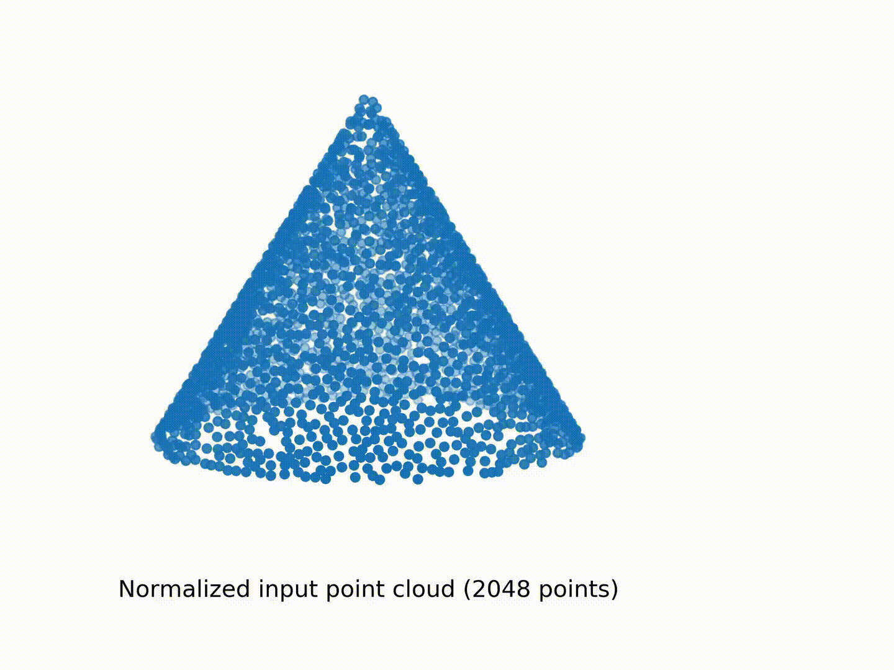

&nbsp;&nbsp;
  

Note: I slightly modified the implementation of aptbps after I used these files.
I went back and changed the files to match the current implementation, but I might have missed something.
Feel free to email me (or open an issue in this repo) if something doesn't work and I'll get back to you as soon as I can!

Refer to the README files in the individual folders for more specific information.